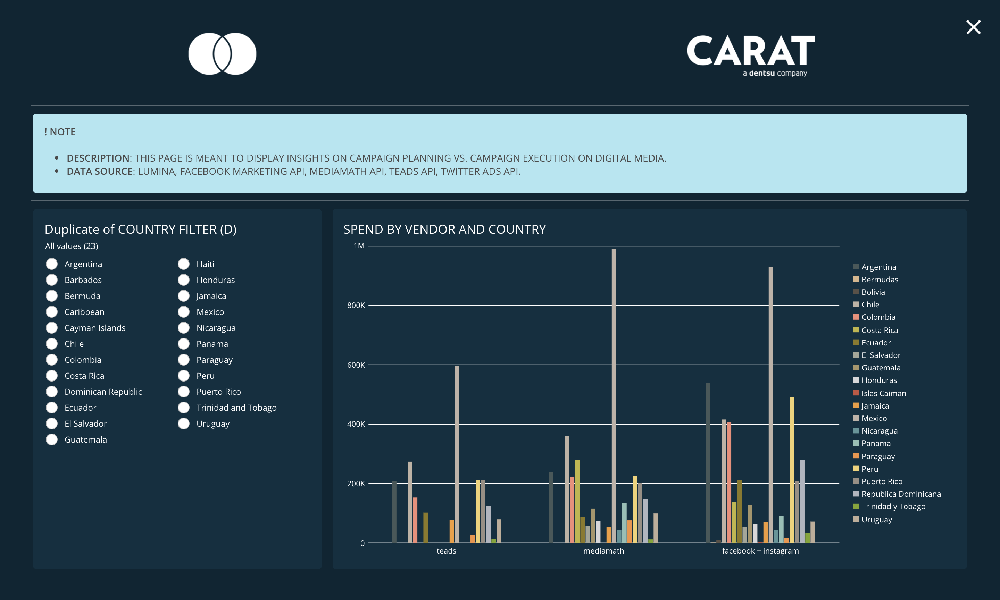

# Mastercard DOMO - Design Guidelines
These guidelines are for the Mastercard LAC dashboards design in DOMO. Topics discussed include:

1. Themes and Colors
2. Layouts
3. Titles
4. Headers

## Themes
Two themes are proposed to support dark/light preferences according to Carat colors.
### Dark Theme
&nbsp;

Element | Color (HEX)
------------ | -------------
Dashboard Background Color |  `#0A2533`
Card Background Color |  `#0D2F40`
Note Background Color |  `#AEE6F2`
Note Font Color |  `4A4A4A`
Filter Selection Color |  `#1DDDF2`
Card Font Color (where applicable) |  `#F2F2F2`  

&nbsp;
#### Data Visualization Colors
Colors preferred for data visualizations. 

Preview | Color (HEX)
------------ | -------------
 | `#465959`
 | `#D9B68B`
 | `#595147`
 | `#BFB3A4`
 | `#F28D77`
 | `#BFB73F`
 | `#8C7A20`
 | `#A4A698`
 | `#A69668`
 | `#D7D7D9`
 | `#C7533F`
 | `#F29D35`
 | `#BFB3A8`
 | `#5D9599`
 | `#91BFB5`
 | `#F29441`
 | `#F2D36F`
 | `#998F84`
 | `#B0B5BF`
 | `#7DA626`
 | `#BFAE99`

&nbsp;
### Light Theme
&nbsp;

Element | Color (HEX)
------------ | -------------
Dashboard Background Color |  `#DFE3E4`
Card Background Color |  `#EBEFF0`
Note Background Color |  `#AEE6F2`
Note Font Color |  `4A4A4A`
Filter Selection Color |  `#1DDDF2`
Card Font Color (where applicable) |  `#F2F2F2`

&nbsp;
#### Header images
For the Dark theme find source img at [img/mc_header_dark.png](img/mc_header_dark.png).  
For the Light theme find source img at [img/mc_header_light.png](img/mc_header_light.png).
