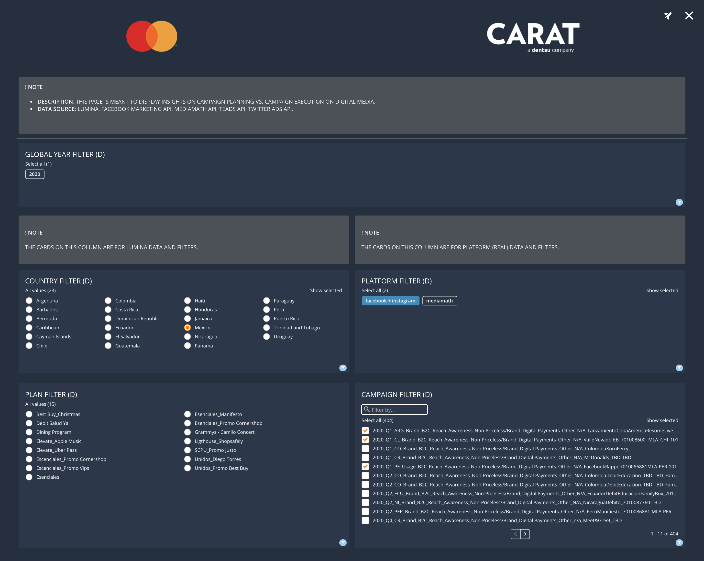

# Mastercard DOMO - Design Guidelines
These guidelines are for the Mastercard LAC dashboards design in DOMO. Topics discussed include:

1. Themes and Colors
2. Layouts
3. Titles
4. Headers

## Themes
Two themes are proposed to support dark/light preferences according to Carat colors.
### Dark Theme
&nbsp;

Element | Color (HEX)
------------ | -------------
Dashboard Background Color |  `#232F3E`
Card Background Color |  `#29384A`
Note Background Color |  `#4B5057`
Note Font Color |  `#F2F2F2`
Filter Selection Color (Slicer) |  `#268CBF`
Filter Selection Color (Checkbox and Radio Buttons) |  `#FF7F00`
Card Font Color (where applicable) |  `#F2F2F2`  

&nbsp;
### Light Theme
&nbsp;

Element | Color (HEX)
------------ | -------------
Dashboard Background Color |  `#DFE3E4`
Card Background Color |  `#EBEFF0`
Note Background Color |  `#AEE6F2`
Note Font Color |  `#4A4A4A`
Filter Selection Color (Slicer) |  `#268CBF`
Filter Selection Color (Checkbox and Radio Buttons) |  `#1DDDF2`
Card Font Color (where applicable) |  `#4A4A4A`

&nbsp;
#### Header images
For the Dark theme find source img at [img/mc_header_dark.png](img/mc_header_dark.png).  
For the Light theme find source img at [img/mc_header_light.png](img/mc_header_light.png).
